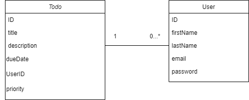

### **Welcome to bfour**

### Bfour is an **open source** and **RESTful** Backend for managing todos and the users associated with them.
Requires:
`Java 17`, `Gradle`
>By Merle Pantwich, Thuy Anh Nguyen, Farham Moazipor-Tehrani, Soheil Nazari
---

**Aufgabe 1a**
```
Die Produktvision besteht darin, eine benutzerfreundliche und minimalistische App zu entwickeln,
die die Verwaltung von To-Do-Listen ermöglicht. Die App soll es den Benutzern ermöglichen,
Aufgaben zu erstellen, zu bearbeiten und zu löschen sowie Fälligkeitsdaten und Prioritäten
festzulegen. Das Hauptaugenmerk liegt auf der Einfachheit und Effizienz, um Benutzern dabei
zu helfen, ihre Aufgaben effektiv zu organisieren und den Überblick zu behalten.
```

**Aufgabe 1b**
```
1. Als Benutzer möchte ich eine neue Aufgabe erstellen können, damit ich meine To-Do-Liste aktualisieren kann.
2. ... eine Aufgabe als erledigt markieren können, um sie von meiner aktiven Aufgabenliste zu entfernen.
3. ... eine Liste meiner aktuellen Aufgaben anzeigen können, um einen Überblick über meine ausstehenden
    Aufgaben zu erhalten.
4. ... Aufgaben nach verschiedenen Kriterien filtern können, wie z.B. Fälligkeitsdatum oder Priorität,
    um meine Aufgaben effektiv zu organisieren.
5. ... meine bereits erstellten Aufgaben bearbeiten können, um Details zu aktualisieren oder Änderungen vorzunehmen.
6. ... meine Aufgaben sortieren können, um eine individuelle Reihenfolge festzulegen, die meinen Bedürfnissen entspricht.
7. ... meine To-Do-Liste speichern können, um meine Aufgaben auch nach dem Schließen der Applikation weiterhin verfügbar zu haben.
```

**Fachliches Datenmodel**



---
**Example Usage**

*Create a user* -> `POST` request to `/user` with the following body:

```Json
{
    "fistName": "John",
    "lastName": "Wick",
    "email": "john@wick.de",
    "password": "boogeyman"
}
```

*Get all users* -> `GET` request to `/user`

*Delete user with the id of `1234`* -> `DELETE` request to `/user/1234`

*Create a todo* -> `POST` request to `/todo` with the following body:

```Json
{
    "title": "Survive!",
    "description": "Excommunicado",
    "userId": 1234
}
```
*Filter Todos by due date* -> `GET` request to `/todo?dueDate=16-06-2023 12:00`

**Available Filtering Options**:

- `dueDate` date format: `dd-MM-yyyy HH:mm`
- `dueDateBefore` date format: `dd-MM-yyyy HH:mm`
- `priority` priorities: `1`, `2`, `3` (Although it's not limited)
- `done` whether a Todo is done, can be either `false` or `true`

*Modify the Todo with the id of 1234* -> `PATCH` request to `/todo/1234` with the following body:

```Json
{
    "title": "Run",
    "description": "As fast as you can",
    "dueDate": "20-09-2024 19:00",
    "priority": 1,
    "done": true
}
```
> Only provide the properties which should be updated

> The userId of a Todo cannot be modified

> Users cannot be modified at the moment
